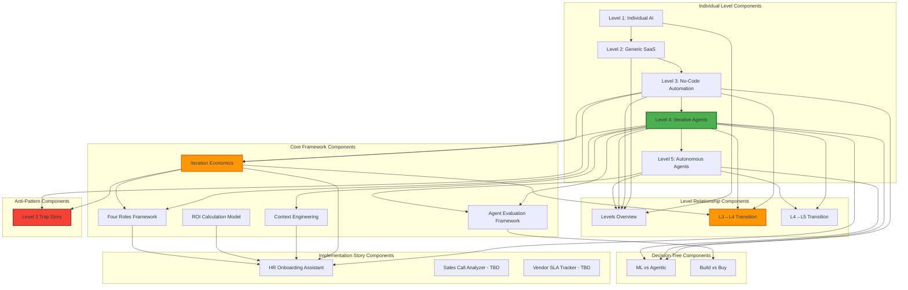

# Knowledge Component Relationship Map

## Purpose

This document provides the **big picture view** of how all knowledge components connect and depend on each other across the Chief AI Academy curriculum. It serves as:

1. **Navigation tool** - Understand the curriculum architecture at a glance
2. **Impact analysis** - See what will be affected when updating a component
3. **Quality assurance** - Ensure no circular dependencies or orphaned components
4. **Onboarding resource** - Help new content creators understand how concepts build on each other
5. **Single-source-of-truth validation** - Verify all references and dependencies are documented

## Visual Overview: Component Dependency Graph



## Component Inventory

### Current State (17/20 components)

| Category | Component ID | Status | Dependencies |
|----------|-------------|--------|--------------|
| **Levels (5/5)** | | | |
| | `level_1_individual_ai` | ✅ Complete | None |
| | `level_2_generic_saas_tools` | ✅ Complete | `level_1_individual_ai` |
| | `level_3_no_code_automation` | ✅ Complete | `level_2_generic_saas_tools` |
| | `level_4_iterative_agents` | ✅ Complete | `level_3_no_code_automation` |
| | `level_5_autonomous_agents` | ✅ Complete | `level_4_iterative_agents` |
| **Level Relationships (3/3)** | | | |
| | `levels_overview` | ✅ Complete | All 5 level components |
| | `level_3_to_4_transition` | ✅ Complete | `level_3_no_code_automation`, `level_4_iterative_agents`, `iteration_economics` |
| | `level_4_to_5_transition` | ✅ Complete | `level_4_iterative_agents`, `level_5_autonomous_agents` |
| **Frameworks (5/6)** | | | |
| | `iteration_economics` | ✅ Complete | `level_3_no_code_automation`, `level_4_iterative_agents` |
| | `four_roles_framework` | ✅ Complete | `level_4_iterative_agents`, `iteration_economics` |
| | `context_engineering_methodology` | ✅ Complete | `level_4_iterative_agents` |
| | `roi_calculation_model` | ✅ Complete | None (used across all levels) |
| | `agent_evaluation_framework` | ✅ Complete | `level_4_iterative_agents`, `level_5_autonomous_agents` |
| | (1 framework TBD - non-critical) | ⏸️ Pending | - |
| **Decision Trees (2/2)** | | | |
| | `ml_vs_agentic` | ✅ Complete | `level_3_no_code_automation`, `level_4_iterative_agents`, `level_5_autonomous_agents` |
| | `build_vs_buy` | ✅ Complete | `agent_evaluation_framework` |
| **Anti-Patterns (1/1)** | | | |
| | `level_3_trap_story` | ✅ Complete | `level_3_no_code_automation`, `iteration_economics` |
| **Stories (1/3)** | | | |
| | `hr_onboarding_assistant` | ✅ Complete | `level_4_iterative_agents`, `iteration_economics`, `context_engineering_methodology`, `roi_calculation_model`, `four_roles_framework` |
| | `sales_call_analyzer` | ⏸️ Pending | `level_4_iterative_agents`, `iteration_economics`, `context_engineering_methodology`, `roi_calculation_model` |
| | `vendor_sla_tracker` | ⏸️ Pending | `level_4_iterative_agents`, `iteration_economics`, `roi_calculation_model` |

## Detailed Component Relationships

### 1. Individual Level Components (Foundational Layer)

These are the atomic building blocks of the curriculum. They form a clear progression path.

#### Level 1: Individual AI (`level_1_individual_ai`)
- **Depends on:** None (entry point)
- **Depended on by:**
  - `level_2_generic_saas_tools` (builds on L1 limitations)
  - `levels_overview` (foundation of progression)

#### Level 2: Generic SaaS Tools (`level_2_generic_saas_tools`)
- **Depends on:** `level_1_individual_ai`
- **Depended on by:**
  - `level_3_no_code_automation` (builds on L2 limitations)
  - `levels_overview`

#### Level 3: No-Code Automation (`level_3_no_code_automation`)
- **Depends on:** `level_2_generic_saas_tools`
- **Depended on by:**
  - `level_4_iterative_agents` (L4 solves L3 problems)
  - `levels_overview`
  - `iteration_economics` (L3 vs L4 comparison)
  - `level_3_to_4_transition` (THE CRITICAL transition)
  - `level_3_trap_story` (why L3 fails)
  - `ml_vs_agentic` (decision context)

**Why L3 is critical:** This is the trap where most organizations get stuck. Understanding L3 is prerequisite to understanding why L4 matters.

#### Level 4: Iterative Agents (`level_4_iterative_agents`)
- **Depends on:** `level_3_no_code_automation`
- **Depended on by:**
  - `level_5_autonomous_agents` (L5 builds on L4 foundation)
  - `levels_overview`
  - `iteration_economics` (L3 vs L4 comparison)
  - `level_3_to_4_transition` (THE CRITICAL transformation)
  - `level_4_to_5_transition` (scaling to autonomy)
  - `four_roles_framework` (organizational structure for L4)
  - `context_engineering_methodology` (how to build L4)
  - `agent_evaluation_framework` (evaluating L4 solutions)
  - `ml_vs_agentic` (when to choose L4)
  - `hr_onboarding_assistant` (L4 implementation example)
  - All pending stories (demonstrate L4 in action)

**Why L4 is critical:** This is where transformation actually begins. L4 is the foundation for most frameworks and all implementation stories.

#### Level 5: Autonomous Agents (`level_5_autonomous_agents`)
- **Depends on:** `level_4_iterative_agents`
- **Depended on by:**
  - `levels_overview`
  - `level_4_to_5_transition` (when to scale)
  - `agent_evaluation_framework` (evaluating multi-agent systems)
  - `ml_vs_agentic` (enterprise scale decision)

### 2. Level Relationship Components (Transition Layer)

These components explain HOW levels connect and WHY transitions matter.

#### Levels Overview (`levels_overview`)
- **Depends on:** All 5 individual level components
- **Depended on by:** Course modules need big picture context
- **Purpose:** Provides the big picture of how all levels relate and progress

#### Level 3 to Level 4 Transition (`level_3_to_4_transition`)
- **Depends on:**
  - `level_3_no_code_automation`
  - `level_4_iterative_agents`
  - `iteration_economics`
- **Depended on by:** F1, F2, S1 modules (THE CRITICAL transformation story)
- **Purpose:** Explains why L3 fails, how L4 solves it, the iteration economics shift

**This is THE MOST IMPORTANT component in the curriculum.** It's where the "aha moment" happens for executives.

#### Level 4 to Level 5 Transition (`level_4_to_5_transition`)
- **Depends on:**
  - `level_4_iterative_agents`
  - `level_5_autonomous_agents`
- **Depended on by:** F1, S3 modules (scaling story)
- **Purpose:** Explains when to scale from iterative to autonomous, multi-agent patterns

### 3. Core Framework Components (Methodology Layer)

These provide the "how-to" knowledge for implementing Level 4.

#### Iteration Economics (`iteration_economics`)
- **Depends on:**
  - `level_3_no_code_automation` (L3 economics)
  - `level_4_iterative_agents` (L4 economics)
- **Depended on by:**
  - `level_3_to_4_transition` (explains why transition matters)
  - `level_3_trap_story` (why trap happens)
  - `four_roles_framework` (roles enable rapid iteration)
  - `hr_onboarding_assistant` (demonstrates economics in action)
  - All pending stories
- **Purpose:** Explains why iteration speed determines success/failure

**This is the theoretical foundation** that explains why L4 works and L3 doesn't.

#### Four Roles Framework (`four_roles_framework`)
- **Depends on:**
  - `level_4_iterative_agents` (roles exist to enable L4)
  - `iteration_economics` (roles enable rapid iteration)
- **Depended on by:**
  - `hr_onboarding_assistant` (Sarah = Agent Manager, Marcus = Developer)
  - All pending stories (demonstrate roles in action)
  - F2 module (organization structure)
- **Purpose:** Defines organizational structure needed for L4 transformation

#### Context Engineering Methodology (`context_engineering_methodology`)
- **Depends on:** `level_4_iterative_agents`
- **Depended on by:**
  - `hr_onboarding_assistant` (demonstrates 5-step process)
  - All pending stories
  - S3 module (deep dive on methodology)
- **Purpose:** Step-by-step process for building L4 agents

#### ROI Calculation Model (`roi_calculation_model`)
- **Depends on:** None (applicable across all levels)
- **Depended on by:**
  - `hr_onboarding_assistant` (ROI analysis)
  - All pending stories
  - Economics case studies
- **Purpose:** Framework for calculating and communicating AI ROI

#### Agent Evaluation Framework (`agent_evaluation_framework`)
- **Depends on:**
  - `level_4_iterative_agents`
  - `level_5_autonomous_agents`
- **Depended on by:**
  - `build_vs_buy` (vendor evaluation)
  - S2 module (understanding agents)
- **Purpose:** 4-component checklist for evaluating agentic solutions

### 4. Decision Tree Components (Strategic Layer)

These help executives make technology choices.

#### ML vs Agentic (`ml_vs_agentic`)
- **Depends on:**
  - `level_3_no_code_automation`
  - `level_4_iterative_agents`
  - `level_5_autonomous_agents`
- **Depended on by:** S1 module (choosing AI technology)
- **Purpose:** Decision criteria for ML vs Agentic approaches

#### Build vs Buy (`build_vs_buy`)
- **Depends on:** `agent_evaluation_framework`
- **Depended on by:** S1 module (technology choice)
- **Purpose:** Framework for build vs buy vs hybrid decisions

### 5. Anti-Pattern Components (Cautionary Layer)

#### Level 3 Trap Story (`level_3_trap_story`)
- **Depends on:**
  - `level_3_no_code_automation`
  - `iteration_economics`
- **Depended on by:**
  - F1 module (warning story)
  - F2 module (what to avoid)
  - Use cases resource files
- **Purpose:** Week-by-week failure timeline showing why L3 fails

### 6. Implementation Story Components (Demonstration Layer)

These demonstrate frameworks and levels working together in real scenarios.

#### HR Onboarding Assistant (`hr_onboarding_assistant`)
- **Depends on:**
  - `level_4_iterative_agents` (L4 implementation)
  - `iteration_economics` (20 iterations to reach 96%)
  - `context_engineering_methodology` (how Sarah and Marcus worked)
  - `roi_calculation_model` (1,051% Year 1 ROI)
  - `four_roles_framework` (Sarah = Agent Manager, Marcus = Developer)
- **Depended on by:**
  - F2 module (roles in action)
  - S3 module (context engineering example)
  - Economics case studies
- **Purpose:** Complete implementation story with iteration timeline and ROI

#### Sales Call Analyzer (Pending)
- **Expected dependencies:**
  - `level_4_iterative_agents`
  - `iteration_economics`
  - `context_engineering_methodology`
  - `roi_calculation_model`
- **Will be depended on by:** F2, S3, economics

#### Vendor SLA Tracker (Pending)
- **Expected dependencies:**
  - `level_4_iterative_agents`
  - `iteration_economics`
  - `roi_calculation_model`
- **Will be depended on by:** F2, economics

## Component Reference Analysis

### Most Referenced Components (High Impact)

These components are referenced most frequently across the curriculum. Updating them affects many modules.

1. **`level_4_iterative_agents`** - Referenced by 13 components/modules
   - Foundation for entire transformation story
   - Update impact: HIGH - affects F1, F2, S1, S2, S3, all stories

2. **`iteration_economics`** - Referenced by 7 components
   - Theoretical foundation for why L4 works
   - Update impact: HIGH - affects F1, F2, all stories, use cases

3. **`level_3_no_code_automation`** - Referenced by 6 components
   - The trap that must be explained to justify L4
   - Update impact: MEDIUM-HIGH - affects F1, transition, economics, trap story

4. **`roi_calculation_model`** - Referenced by 4+ components
   - Used across all economics case studies
   - Update impact: HIGH for economics content

5. **`context_engineering_methodology`** - Referenced by 4+ components
   - Core methodology for S3 module
   - Update impact: MEDIUM - primarily affects S3 and stories

### Foundational Components (Build on These)

These components have many dependents but few dependencies themselves.

- `level_1_individual_ai` - Entry point (0 dependencies, 2+ dependents)
- `level_4_iterative_agents` - Transformation enabler (1 dependency, 13+ dependents)
- `roi_calculation_model` - Universal framework (0 dependencies, 4+ dependents)

### Bridge Components (Connect Multiple Areas)

These components create connections between different parts of the curriculum.

- `iteration_economics` - Connects L3, L4, and all implementation stories
- `level_3_to_4_transition` - Connects levels to frameworks and stories
- `four_roles_framework` - Connects L4 to organizational implementation

## Validation Rules

### No Circular Dependencies ✅

The dependency graph is **acyclic** - no component A depends on B which depends on A.

**Validation method:**
```bash
# Check for circular references in front-matter dependencies
# All dependencies should point "downstream" in the graph
```

### All Dependencies Resolvable ✅

Every component listed in a `dependencies:` field must exist as a file.

**Validation method:**
```bash
grep -r "dependencies:" executive_track/education_full/resources/knowledge_components/**/*.md
# Verify each ID matches an existing component file
```

### Orphaned Component Detection

No components should exist without being referenced by at least one module, learning path, or other component.

**Current orphans:** None detected (all 17 components are referenced)

## Impact Analysis Guide

### Before Updating a Component: Ask These Questions

1. **What depends on this component?**
   - Check "Depended on by" section for this component
   - Search codebase for component ID references: `grep -r "component_id" executive_track/`

2. **What modules will be affected?**
   - Check module reference analysis below
   - All modules that include this component will see changes

3. **Do the changes break the narrative?**
   - Read the referencing modules to ensure changes fit context
   - Verify presentation formats still make sense

4. **Should this be a version bump?**
   - Minor changes (typos, clarity) = patch version (1.0.1)
   - New examples or formats = minor version (1.1.0)
   - Breaking changes to structure = major version (2.0.0)

### Module Reference Matrix

| Module | Most Referenced Components |
|--------|---------------------------|
| F1: Five Levels Framework | `level_1-5` (all levels), `levels_overview`, `level_3_to_4_transition`, `iteration_economics`, `level_3_trap_story` |
| F2: Organization Structure | `four_roles_framework`, `hr_onboarding_assistant`, `level_4_iterative_agents`, `iteration_economics` |
| S1: Choosing AI Technology | `ml_vs_agentic`, `build_vs_buy`, `level_3_no_code_automation`, `level_4_iterative_agents` |
| S2: Understanding Agents | `agent_evaluation_framework`, `level_4_iterative_agents`, `level_5_autonomous_agents` |
| S3: Managing AI | `context_engineering_methodology`, `hr_onboarding_assistant`, `level_4_iterative_agents`, `four_roles_framework` |

## Component Update Propagation Testing

### Test Scenarios (Phase 5 Validation)

1. **Update Level 4 Definition**
   - Change: Modify `level_4_iterative_agents.md` summary format
   - Expected propagation: F1, F2, S1, S2, S3, all stories, transition components
   - Validation: grep for component references, verify updated content appears

2. **Update Iteration Economics**
   - Change: Add new visual format to `iteration_economics.md`
   - Expected propagation: F1, level_3_to_4_transition, hr_onboarding_assistant, level_3_trap_story
   - Validation: Check all modules can access new visual format

3. **Update HR Onboarding Story**
   - Change: Add more iteration details to `hr_onboarding_assistant.md`
   - Expected propagation: F2, S3, economics case studies
   - Validation: Story updates appear in all referencing modules

### Success Criteria for Single-Source-of-Truth

✅ **Zero manual synchronization required** - updating one component file propagates automatically
✅ **Component relationship map accuracy** - map matches actual file references
✅ **No duplicate content** - core concepts appear only in component files, not embedded in modules

## Maintenance Checklist

### When Adding a New Component

- [ ] Create component file with front-matter metadata
- [ ] Add component to this relationship map
- [ ] Update dependency graph (mermaid diagram)
- [ ] Add to component inventory table
- [ ] Document dependencies and dependents
- [ ] Update impact analysis section
- [ ] Test component references in target modules
- [ ] Verify no circular dependencies introduced

### When Updating an Existing Component

- [ ] Check "Depended on by" section for impact
- [ ] Review all referencing modules for context fit
- [ ] Update version number in front-matter
- [ ] Update `last_updated` date
- [ ] Run propagation validation tests
- [ ] Update this map if dependencies change

### Monthly Maintenance

- [ ] Validate all component IDs in dependencies exist
- [ ] Check for orphaned components (exist but never referenced)
- [ ] Verify mermaid diagram matches current state
- [ ] Run duplication analysis (ensure <20% for core frameworks)
- [ ] Update component reference statistics

## Future Enhancements

### Automated Tooling (To Be Built)

1. **Dependency Validator**
   - Script to parse all front-matter `dependencies:` fields
   - Verify all referenced component IDs exist
   - Detect circular dependencies
   - Generate warnings for orphaned components

2. **Reference Analyzer**
   - Search all modules for component references (`{{kc:component_id:format}}`)
   - Build reference count statistics
   - Generate "what depends on this" reports
   - Identify unused presentation formats

3. **Relationship Map Auto-Generator**
   - Parse all component front-matter
   - Auto-generate mermaid diagram
   - Keep this document synchronized with actual state
   - Detect drift between map and reality

4. **Impact Analysis Tool**
   - Input: component ID
   - Output: list of all modules, learning paths, and components affected
   - Show reference locations and formats used
   - Estimate update scope

---

## Quick Reference Card

### Component Categories at a Glance

- **5 Levels** - Foundational progression (L1 → L2 → L3 → L4 → L5)
- **3 Level Relationships** - How levels connect (Overview, L3→L4, L4→L5)
- **5 Frameworks** - How-to methodologies (Iteration Economics, Four Roles, Context Engineering, ROI, Agent Evaluation)
- **2 Decision Trees** - Strategic choices (ML vs Agentic, Build vs Buy)
- **1 Anti-Pattern** - What to avoid (Level 3 Trap)
- **1 Story (3 planned)** - Implementation examples (HR Onboarding, Sales Analysis, Vendor SLA)

### Critical Path for Understanding Curriculum

1. Start: `level_1_individual_ai` → `level_2_generic_saas_tools` → `level_3_no_code_automation`
2. **THE CRITICAL MOMENT:** `level_3_to_4_transition` (requires `iteration_economics`)
3. Transformation: `level_4_iterative_agents` → `four_roles_framework` → `context_engineering_methodology`
4. Evidence: `hr_onboarding_assistant` (demonstrates all frameworks in action)
5. Scale: `level_4_to_5_transition` → `level_5_autonomous_agents`

### Update Impact Hierarchy

**Highest Impact (affects 10+ modules/components):**
- `level_4_iterative_agents`
- `iteration_economics`

**High Impact (affects 5-10):**
- `level_3_no_code_automation`
- `level_3_to_4_transition`
- `context_engineering_methodology`

**Medium Impact (affects 3-5):**
- `four_roles_framework`
- `roi_calculation_model`
- `hr_onboarding_assistant`

**Lower Impact (affects 1-3):**
- Individual L1, L2, L5 components
- Decision trees
- Anti-patterns

---

**Document Version:** 1.0.0
**Last Updated:** 2025-01-16
**Maintained by:** Curriculum Development Team
**Review Frequency:** Monthly or when component structure changes
