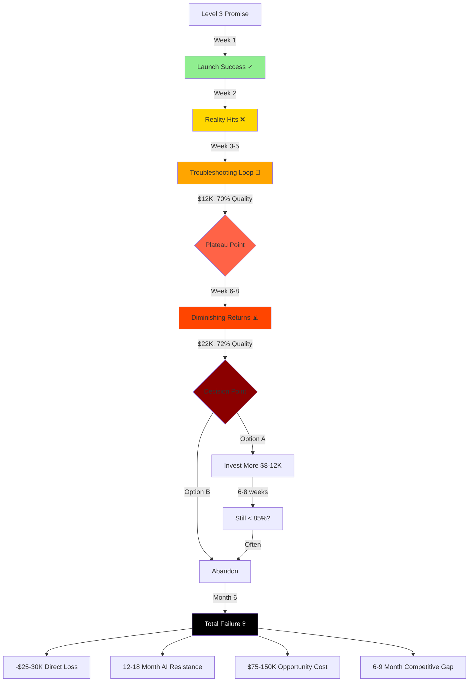

# Level 3 Trap - The Failure Timeline

---
id: level_3_trap_story
title: Level 3 Trap - Week-by-Week Failure Pattern
category: anti_patterns
tags: [level-3, trap, failure, warning, no-code, iteration-economics]
presentation_formats: [full, summary, timeline, visual]
estimated_time:
  full: 8 minutes
  summary: 1 minute
  timeline: 4 minutes
dependencies: [level_3_no_code_automation, iteration_economics]
version: 1.0.0
last_updated: 2025-01-16
---

## Overview

THE TRAP is the most common and expensive AI transformation failure pattern. Organizations adopt Level 3 (no-code automation tools like Zapier, Make.com) believing they've solved AI integration, only to discover after weeks or months that shallow integration cannot deliver reliable business value.

**The Critical Numbers:**
- **Timeline**: Week 1 (launch) → Week 2 (complaints) → Week 6-10 (plateaus at 65-75% quality) → Month 6 (abandoned)
- **Economics**: -$25-30K ROI (sunk costs + opportunity cost + organizational damage)
- **Worst Outcome**: 12-18 months of organizational AI resistance

---

## Format: Full Story

### The Seductive Promise

Level 3 tools make compelling promises:
- "Connect AI to your business systems in minutes"
- "No developers needed"
- "See ROI in weeks, not months"
- "Start free, scale when ready"

**The demos look perfect.** Pre-scripted scenarios work flawlessly. The consultant shows you a chatbot answering questions from your Google Drive, or an automation that processes invoices, or a workflow that analyzes customer data.

**The pricing seems reasonable.** $500-2,000/month for licenses plus $3,000-8,000 for initial setup. Compare that to $40-50K for Level 4 custom development.

**The timeline is attractive.** "We'll have you live in 1-2 weeks" vs "3 months for custom agents."

### Week 1: Launch (Optimism)

✓ Setup completed
✓ Demo scenarios work perfectly
✓ Team trained on basic usage
✓ Initial excitement high

**What you don't see yet:**
- Integration is only surface-level (current status, not full history)
- Prompts are generic (no domain-specific logic)
- Edge cases haven't been tested with real data
- The consultant is about to become your bottleneck

### Week 2: Complaints Start (First Cracks)

❌ Real users report wrong answers
❌ Edge cases that seemed "obvious" weren't handled
❌ Integration too shallow (missing critical context)

**Example - HR Onboarding Bot:**
- Demo question: "What's the PTO policy?" → Works perfectly ✓
- Real question: "I'm starting in 3 weeks but want vacation in 2 months—do I have PTO by then?"
  - Needs: Date math + accrual calculation + probation period logic
  - Bot's answer: Generic policy text (doesn't actually answer the question)

**Your team's response:** "We need to fix these edge cases"

**The consultant's response:** "Yes, we can add that logic. Let me scope it... $1,200 + 4-5 days per iteration"

### Week 3-5: Troubleshooting Loop (The Expensive Reality)

**The pattern emerges:**
1. User reports failure
2. You document it and explain to consultant (email/screenshots/Loom videos)
3. Consultant adds it to queue (they have other clients)
4. 4-7 days later: update deployed
5. Test reveals 2-3 MORE edge cases
6. Repeat

**Economics per iteration:**
- Consultant: $1,000-2,000
- Your team's time documenting/testing: $300-500
- Delay: 5-7 days
- **Total: $1,500-2,500 per cycle, 1 iteration per week**

**After 5 iterations (5 weeks):**
- Investment: ~$12K
- Quality: 70-75% (improvement slowing)
- Remaining issues: Still 25-30%

### Week 6-8: The Plateau (Diminishing Returns)

**The brutal economics:**
- Each new fix takes longer (complexity compounding)
- Each iteration yields smaller improvements (1-2% gains)
- Consultant needs more time to understand your systems
- Communication overhead increasing

**What you discover:**

1. **Integration isn't deep enough:**
   - You thought "connect to CRM" meant full context
   - Reality: It pulls current status only, not history/relationships/cross-system data
   - Fixing requires different API tier → Additional $3-6K

2. **Multi-system logic is complex:**
   - Real workflows need: System A + System B + business rules + timing logic
   - Consultant: "That's enterprise-tier integration. Different scope. $5-8K + 3-4 weeks"

3. **The workflow itself needs redesigning:**
   - You specified "answer questions" but users need "action steps"
   - Or you specified "score calls" but sales team needs "identify coachable moments"
   - **Workflow redesign = starting over**

**Current state:**
- Investment: $18-22K
- Quality: Plateaued at 72-75%
- Team adoption: Dropping (not reliable enough)

### Week 10-12: The Decision Point (Sunk Cost Trap)

**You face the choice:**

**Option A: Keep investing**
- Consultant estimates another $8-12K to get to 85%
- Timeline: 6-8 more weeks
- Risk: Still might not be production-ready
- **This is the sunk cost fallacy**

**Option B: Abandon**
- Write off $20-25K
- Lost time: 3 months
- Opportunity cost: Could've had Level 4 agent deployed by now
- **Organizational damage:** Team now skeptical of ALL AI initiatives

**Most companies choose Option B around Month 3-6**

### Month 6: Abandoned (The Real Costs)

**Direct Costs:**
- Technology licenses: $3-6K
- Consultant fees: $15-20K
- Internal time: $5-8K
- **Total sunk: $25-30K**

**Indirect Costs (The Devastating Part):**

1. **Organizational AI Resistance: 12-18 months**
   - "We tried AI, it didn't work"
   - Leadership skeptical of future AI proposals
   - Budget committees require "proof it won't be like last time"

2. **Opportunity Cost:**
   - Could've invested $50K in Level 4 → $150-300K annual value
   - Instead: -$30K + 6 months delay
   - **Real cost: $30K + $75-150K opportunity loss**

3. **Competitive Disadvantage:**
   - While you struggled with Level 3, competitors deployed Level 4
   - They're now 6-9 months ahead in iteration cycles
   - Market perception: You're behind on AI

---

## Format: Summary

**THE TRAP: Week 1 excitement → Week 2 complaints → Week 6-8 plateau at 72% quality → Month 6 abandoned with -$25-30K ROI + 12-18 months of organizational AI resistance.**

No-code automation (Level 3) seems fast and cheap but can only afford ~1 iteration/week due to consultant dependency. After 5-10 iterations with 1-3% improvement each, projects plateau at 65-75% quality—below the reliability threshold for business adoption.

The most expensive outcome isn't the sunk cost—it's the organizational scar tissue that blocks AI initiatives for the next 12-18 months.

**Warning signs you're in the trap:**
- Iteration takes 5-7 days and costs $1,500-2,500
- Quality improving <2% per iteration
- "Just one more fix" has been said 5+ times
- Team adoption declining despite fixes

---

## Format: Timeline Visual

```
Week 1  [Launch] ✓ Demo works perfectly. Team excited.
    |
Week 2  [Reality] ❌ Real users report failures. "We can fix these edge cases"
    |
Week 3-5 [Loop] 🔄 Consultant troubleshooting. $1,500-2,500 per iteration. 5-7 days each.
    |   Investment: ~$12K | Quality: 70-75%
    |
Week 6-8 [Plateau] 📊 Diminishing returns. 1-2% gains per iteration.
    |   Investment: $18-22K | Quality: 72-75% (stuck)
    |   Team adoption: Declining (not reliable enough)
    |
Week 10-12 [Decision] ⚖️ Sunk Cost Trap
    |   Option A: Invest another $8-12K for uncertain results
    |   Option B: Abandon → -$25-30K + organizational damage
    |
Month 6 [Abandoned] 💀
    Direct Loss: $25-30K sunk costs
    Organizational Resistance: 12-18 months
    Opportunity Cost: $75-150K (could've had L4 deployed)
    Competitive Disadvantage: 6-9 months behind
```

**The Critical Pattern:**
- **Iteration Speed**: 1 per week (consultant dependency)
- **Total Iterations**: 5-10 before abandonment
- **Quality Reached**: 65-75% (below adoption threshold)
- **Improvement Rate**: 1-3% per iteration → diminishing returns

**Compare to Level 4:**
- **Iteration Speed**: 1-3 per day (internal team)
- **Total Iterations**: 20-60 in same timeframe
- **Quality Reached**: 95%+ (production-ready)
- **Improvement Rate**: 3-6% per iteration → compounding gains

---

## Format: Visual Diagram



**The Trap Mechanism:**

```
Low Iteration Speed (1/week)
    ↓
Limited Total Iterations (5-10)
    ↓
Insufficient Quality Gains (1-3% each)
    ↓
Plateau Below Adoption Threshold (65-75%)
    ↓
Business Rejection
    ↓
Sunk Cost Dilemma
    ↓
Abandonment + Organizational Damage
```

---

## Warning Signs You're In The Trap

**Early indicators (Week 2-4):**
- [ ] Iteration takes >3 days to implement simple changes
- [ ] Each fix costs $1,000+ in consultant fees
- [ ] Real-world edge cases keep emerging unexpectedly
- [ ] Integration is "current status" not "full context"
- [ ] You're explaining your business logic via email/screenshots

**Mid-stage indicators (Week 6-10):**
- [ ] Quality improvements <2% per iteration
- [ ] "Just one more fix" has been said 5+ times
- [ ] Team adoption declining despite fixes
- [ ] Consultant needing more time to understand your systems
- [ ] Discovering the workflow itself needs redesigning

**Late-stage indicators (Week 10+):**
- [ ] Investment exceeded $20K with <80% quality
- [ ] Sunk cost fallacy arguments in meetings
- [ ] Team suggesting "maybe we should just do it manually"
- [ ] Leadership asking "when will this be production-ready?"
- [ ] Consultant proposing "enterprise tier" upgrade

**Critical threshold:**
If you've invested >$15K and quality is still <80% after 8+ weeks, you're likely in the trap. The path to 95% reliability is exponentially more expensive from here.

---

## How to Avoid The Trap

### Recognition

**Before starting Level 3, ask:**
1. How many iterations will this need to reach 95% reliability?
2. What's the cost and timeline per iteration?
3. Can the vendor do 1-3 iterations per day (not per week)?
4. What happens when we discover the workflow needs redesigning?

**If answers are:**
- 5-10 iterations expected
- 5-7 days per iteration
- Vendor has other clients (can't iterate daily)
- Workflow changes require rescoping

**You're headed for the trap.** Level 4 is cheaper long-term.

### The Level 4 Alternative

**Same investment ($50-60K first year), fundamentally different outcome:**
- Iteration speed: 1-3 per day (not per week)
- Total iterations: 20-60 in 8-10 weeks
- Quality reached: 95%+ (production-ready)
- ROI: $150-300K annual value
- Organizational impact: AI credibility established

**The math:**
- Level 3: $30K sunk + $75K opportunity cost = **-$105K**
- Level 4: $58K investment → $150K value = **+$92K**
- **Difference: $197K in Year 1**

### Escape Route (If Already In)

**If you're currently stuck at Level 3:**

1. **Recognize sunk cost fallacy**
   - Money already spent is gone
   - Decision: Best path forward from HERE

2. **Calculate true cost of continuing:**
   - Consultant estimate for 95% reliability
   - Probability of success (ask for references)
   - Opportunity cost of delay

3. **Compare to Level 4 pivot:**
   - $40-50K initial investment
   - 8-10 weeks to production
   - 95%+ reliability guaranteed through iteration

4. **Make the call:**
   - If L3 path is >$30K more + uncertain outcome
   - Pivot to L4 immediately
   - Treat L3 investment as learning cost

**Most companies save money by pivoting at Week 8-12 rather than continuing to Month 6.**

---

## Real-World Trap Examples

### Example 1: HR Onboarding Assistant

**Level 3 attempt:**
- Week 1: Launched Zapier chatbot connected to Google Drive handbook
- Week 2: Wrong answers on timing questions (no date math logic)
- Week 3-5: Consultant troubleshooting ($8K, 3 iterations)
- Week 6-8: Plateaued at 72% accuracy
- Week 10: Usage dropped to 28% (not reliable)
- **Outcome: -$25K ROI, shelved**

**Why it failed:**
- Needed: Date calculations + multi-document context + probation logic + policy precedence rules
- Got: Simple document retrieval
- Iteration speed: 1 per week (consultant dependency)
- Could only afford 10 iterations → insufficient for complexity

### Example 2: Customer Support Agent

**Level 3 attempt:**
- Week 1: Make.com connecting CRM + order system + support tickets
- Week 2: 15% escalation rate (data staleness, shallow integration)
- Week 4-6: Support team stops trusting it, answers manually anyway
- Week 8-10: Reached 68% coverage, still too many edge cases
- Week 12: Shelved, customer trust damaged
- **Outcome: -$22K, organizational AI resistance**

**Why it failed:**
- Needed: Full payment history + real-time webhooks + cross-system business logic + sequence understanding
- Got: Current status polling across systems
- Integration too shallow for real customer scenarios
- Each deepening attempt required "enterprise tier" rescoping

### Example 3: Sales Call Analyzer

**Level 3 attempt:**
- Week 1: Gong + Make.com + OpenAI scoring calls
- Week 2: Sales team complains scores "don't match reality"
- Week 4-6: $6K consultant fees, still can't capture quality vs presence
- Week 8: Realized workflow itself is wrong (need coachable moments, not scores)
- Week 10-12: Workflow redesign quote: $8K + 6 weeks
- Week 12: Paused, Sales Director lost faith in AI
- **Outcome: -$23K, sales leadership now AI-skeptical**

**Why it failed:**
- Needed: Contextual judgment + deal-size awareness + multi-call history + specific coaching moments
- Got: Rigid scoring rubric
- Discovered through iteration that WORKFLOW needed redesigning (from scoring to moment identification)
- No-code tools can't afford the iteration volume to discover this

---

## The Organizational Scar Tissue

**The most expensive outcome of THE TRAP isn't the direct financial loss—it's the organizational damage that persists for 12-18 months:**

### Cultural Impact

**Leadership:**
- "We tried AI automation, it didn't deliver"
- Skepticism toward future AI proposals
- Budget committees now require proof against repeat failures

**Teams:**
- "AI tools don't actually work in the real world"
- Resistance to adopting future AI initiatives
- Preference for manual processes ("at least we can trust it")

**IT/Innovation:**
- Blamed for failed project (even if vendor issue)
- Harder to get approval for future AI investments
- Must overcome "not like last time" objections

### Competitive Disadvantage

**While you struggled with Level 3 (Month 1-6):**
- Competitors deployed Level 4 agents
- They've been iterating and improving for 6 months
- They have 3-5 production agents delivering ROI
- Market perceives them as AI-forward

**Your recovery path:**
- Month 6-12: Rebuild credibility, get approval for proper approach
- Month 12-15: Deploy first Level 4 agent
- **You're now 12-15 months behind** where you could've been

### Financial Cascading

**Direct + Indirect Costs:**
- Sunk costs: $25-30K
- Opportunity cost: $75-150K (value you didn't capture)
- Delayed competitive advantage: Harder to quantify, often larger than both above
- **Total first-year impact: $100-200K+**

**Compare to Level 4 path:**
- Investment: $58K first year
- Value delivered: $150-300K
- Net Year 1: +$92-242K
- **Difference: $192-442K**

---

## Related Components

**Prerequisites (understand these first):**
- {{kc:level_3_no_code_automation:full}} - What Level 3 actually is
- {{kc:iteration_economics:full}} - Why iteration speed determines success

**Alternatives (how to avoid the trap):**
- {{kc:level_3_to_4_transition:full}} - The critical shift that works
- {{kc:level_4_iterative_agents:full}} - The transformation enabler

**Learn from failures:**
- {{kc:hr_onboarding_assistant:full}} - Real implementation showing L3 trap vs L4 success
- {{kc:sales_call_analyzer:full}} - Example where workflow redesign was needed
