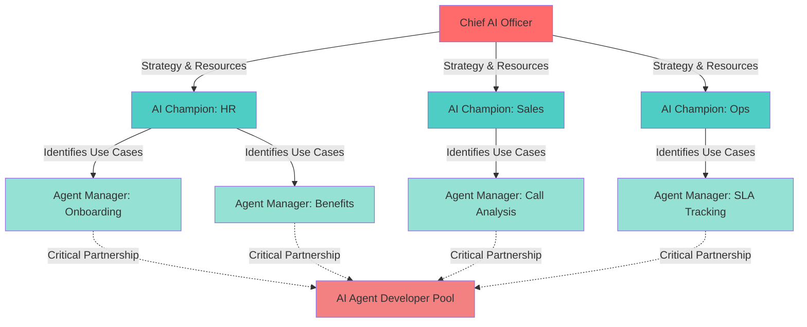

# Four Roles Framework for AI Transformation

---
id: four_roles_framework
title: Four Roles Framework - Organizational Structure for Level 4
category: frameworks
tags: [roles, organization, structure, level-4, partnership, team-sizing]
presentation_formats: [full, summary, visual, checklist]
estimated_time:
  full: 10 minutes
  summary: 2 minutes
  visual: 1 minute
dependencies: [level_4_iterative_agents, iteration_economics]
version: 1.0.0
last_updated: 2025-01-16
---

## Overview

Level 4 transformation doesn't happen by accident—it requires specific roles working in specific ways. The Four Roles Framework defines the organizational structure that enables rapid iteration (1-3 cycles/day), which is the defining characteristic of Level 4 Iterative Agents.

**The Four Roles:**
1. **Chief AI Officer** - Strategic leadership, company-wide
2. **AI Champions** - Department leadership, one per department
3. **Agent Managers** - Process experts, one per use case
4. **AI Agent Developers** - Technical builders, shared resource

**Critical Insight:** The Agent Manager + AI Agent Developer partnership is what creates Level 4. This co-located pairing enables the rapid feedback loops (minutes, not weeks) that transform 60% prototypes into 95%+ reliable production systems through 20+ iterations.

---

## Format: Full Framework

### Role 1: Chief AI Officer (Strategic Leadership)

**Scope:** Company-wide AI transformation

**Responsibilities:**
- Set AI strategy and transformation roadmap
- Make technology decisions: ML vs Agentic vs ready-made tools
- Allocate budget and resources across departments
- Report ROI to CEO and board
- Own company-wide transformation success
- Remove organizational blockers
- Establish governance and compliance standards

**Who Fills This Role:**
- Existing C-suite executive (CTO, COO, Chief Innovation Officer) adding AI to their portfolio
- New hire if company is making serious AI transformation commitment
- Must have executive influence and strategic thinking capability
- Technical depth helpful but not required (has developers for that)

**Time Commitment:**
- Strategic oversight role, not day-to-day execution
- Typically 20-30% of existing executive's time initially
- May become full-time role as transformation scales to 15+ use cases

**Success Metrics:**
- Company-wide ROI from AI initiatives
- Number of production agents deployed
- Cross-department adoption rates
- Strategic positioning vs competitors

**Key Characteristic:** Drives transformation from the top, enables department leaders to succeed

---

### Role 2: AI Champions (Department Leadership)

**Scope:** One per department (HR, Sales, Marketing, Operations, Engineering, Finance, etc.)

**Responsibilities:**
- Lead AI transformation within their department
- Identify and prioritize use cases for their area
- Advocate for adoption and cultural change
- Measure department-level ROI
- Report progress to Chief AI Officer
- Bridge between department needs and technical capabilities
- Manage change resistance within department

**Who Fills This Role:**
- Department heads or senior managers
- People who understand department processes deeply
- Strong communicators who can evangelize change
- Must have credibility and influence within their department
- Examples: VP of Sales, HR Director, Head of Operations

**Time Commitment:**
- Initial phase: 10-20% time (this is a role, not a full job)
- As transformation scales: May become 40-60% or even full-time
- Varies by department size and number of active use cases

**Success Metrics:**
- Number of production agents in their department
- Department-level ROI from AI initiatives
- Team adoption rates
- Process efficiency improvements

**Key Characteristic:** Leadership role, not technical role. They guide transformation, not build agents.

---

### Role 3: Agent Manager (The Critical Role)

**Scope:** One per process/use case (may cover multiple related use cases once experienced)

**Responsibilities:**
- Document process step-by-step (what, when, why, edge cases)
- Prepare context for AI (context engineering - the critical skill)
- Identify knowledge sources (documents, systems, tacit knowledge)
- Validate AI outputs in real-time (is it correct? useful? complete?)
- Maintain and update agent knowledge over time
- Extract tacit knowledge through rapid iteration with developer
- Learn AI capabilities through developer partnership

**Two Paths to Building:**

**Path 1: Partnership with Developer (Standard)**
- Agent Manager documents process and validates outputs
- Developer builds technical implementation
- Together they iterate 1-3 times per day
- Best for: Complex integrations, multi-system workflows, production-critical applications

**Path 2: Agent Manager Builds Alone (Emerging)**
- Agent Manager uses agentic development tools (Cursor IDE, Claude Code)
- No coding required - uses natural language to build
- Can prototype and iterate independently
- Best for: Simple workflows, individual productivity, proof-of-concept before involving developers

**When Path 2 Works:**
- ✅ Simple use case (answering questions from documents, basic automation)
- ✅ Limited system integration (1-2 tools maximum)
- ✅ Agent Manager has 10-15 hours to learn new tools
- ✅ Low risk if initial quality is imperfect

**When Path 1 Required:**
- ⚠️ Complex multi-system integration
- ⚠️ Production-critical reliability needs
- ⚠️ Security/compliance requirements
- ⚠️ Multi-agent orchestration

**Key Insight:**
Both paths achieve Level 4 (rapid iteration, 95%+ reliability) - the difference is WHO does the technical implementation. The iteration capability is what defines Level 4, not whether you have a developer.

**Why Agent Manager is THE CRITICAL ROLE for Level 4 Success:**

This role enables the rapid iteration that defines Level 4:

**What Agent Manager Brings:**
- **Domain expertise integrated into the build team** (not external consultant)
- **Direct collaboration** with AI Agent Developer (no communication barriers)
- **Immediate validation** of outputs (minutes, not weeks per cycle)
- **Tacit knowledge extraction** through rapid iteration (can't document upfront)
- **AI capability learning** through developer partnership
- **Sustained iteration capability** throughout build and maintenance

**This Enables:**
- 1-3 iterations per day (vs 1 per week with external consultants)
- 20+ total iterations over 2-3 weeks (vs 5-10 with agencies)
- Production systems that handle real complexity (95%+ reliability)
- Hidden complexity discovered and addressed through iteration

**Who Fills This Role:**
- Process experts from existing teams (**NOT developers**)
- People who know the process best through years of experience
- Examples: Senior HR specialist (8+ years), top sales rep, senior project manager, operations lead
- Must be able to articulate what "good" vs "bad" outputs look like
- Knows edge cases, exceptions, and unwritten rules

**Time Commitment:**
- During build (2-3 weeks): 50-70% time (intense collaboration period)
- After launch: 10-20% time for maintenance and refinement
- Returns to regular role with ongoing Agent Manager responsibility

**Success Metrics:**
- Agent accuracy/reliability (target: 95%+)
- Coverage of real-world scenarios
- User adoption rates
- Time saved for end users

**Key Characteristic:** THIS ROLE MAKES OR BREAKS TRANSFORMATION

**What They Are NOT:**
- ❌ Developers or data scientists
- ❌ Project managers coordinating external vendors
- ❌ Business analysts writing requirements docs

**What They ARE:**
- ✅ Process experts with deep domain knowledge
- ✅ Knowledge architects who prepare context
- ✅ Quality validators who spot errors immediately
- ✅ Rapid iteration partners with developers

---

### Role 4: AI Agent Developer (Technical Builder)

**Scope:** Technical implementation across multiple use cases (shared resource)

**Responsibilities:**
- Build AI agents using context from Agent Manager
- Integrate with business systems (CRM, databases, APIs)
- Implement workflows and orchestration logic
- Optimize performance and handle edge cases
- Maintain technical infrastructure
- Iterate rapidly based on Agent Manager feedback
- Teach Agent Managers about AI capabilities

**Technical Skills Required:**
- Software development (Python, JavaScript, or similar)
- API integration experience
- Agentic AI architecture (can be learned in 2-4 weeks)
- System design and debugging
- Understanding of LLMs and prompt engineering

**Who Fills This Role:**
- Existing software developers (with 2-4 week upskilling on agentic AI)
- New hires with development experience
- Must be strong collaborators (50% of success is partnership with Agent Manager)
- Experience with APIs and integrations very helpful

**Time Commitment:**
- Full-time role
- Can support 3-5 active Agent Manager partnerships simultaneously
- Each use case: 2-3 weeks intensive build, then maintenance

**Success Metrics:**
- Number of production agents deployed
- Technical reliability and performance
- Integration quality
- Iteration speed (time from feedback to fix)

**Key Characteristic:** Success depends entirely on partnership with Agent Manager. A brilliant developer working alone cannot deliver Level 4—they lack the domain expertise to validate outputs and discover hidden requirements through iteration.

---

## The Critical Partnership: Agent Manager + Developer = Level 4

**The Magic Formula:**

```
Agent Manager (Process Expert) + AI Agent Developer (Technical Expert)
Co-Located or Tightly Coordinated
= RAPID FEEDBACK LOOPS
= Level 4 Iterative Agents
```

**THIS PARTNERSHIP STRUCTURE IS WHAT CREATES LEVEL 4.**

### What Each Brings

| Capability | Agent Manager | AI Agent Developer |
|------------|---------------|-------------------|
| **Knows the process deeply** | ✅ 5-10 years experience | ❌ Learning from scratch |
| **Knows all the edge cases** | ✅ Lived experience | ❌ Doesn't have context |
| **Can validate outputs immediately** | ✅ Spots errors in seconds | ❌ Doesn't know what's correct |
| **Knows tacit knowledge** | ✅ Unwritten rules | ❌ Not documented anywhere |
| **Can build the agent** | ❌ Not technical | ✅ Technical expertise |
| **Can integrate systems** | ❌ Not a developer | ✅ API/integration skills |
| **Can optimize performance** | ❌ Not technical | ✅ Engineering skills |

**Agent Manager brings:** Process knowledge + Context + Validation capability + Edge case awareness

**Developer brings:** Technical ability to build + System integration + Performance optimization

**Together:** Technically sound AND process-accurate agent that handles real-world complexity

### Why This Partnership Enables Rapid Iteration

**The Feedback Cycle (happens 1-3 times per DAY):**

1. **Developer builds feature** (30 minutes)
2. **Agent Manager tests** (10 minutes)
3. **Agent Manager sees problem, explains context** (5 minutes - because they're co-located)
4. **Developer fixes** (20 minutes)
5. **Repeat**

**Cycle time: ~65 minutes. Cost: MINUTES of time, not weeks + consultant fees.**

**This cycle happening 1-3 times per day during active development is THE definition of Level 4.**

**Over 2-3 weeks:**
- 20-60 total iterations (vs 5-10 with external agencies)
- Domain expertise extracted through rapid feedback (not upfront documentation)
- Agent Manager learns AI capabilities from developer
- Developer understands edge cases from Agent Manager feedback
- Result: Production-grade system handling real complexity (95%+ reliability)

### Timeline Comparison

| Approach | Structure | Iteration Speed | Total Iterations | Outcome |
|----------|-----------|----------------|------------------|----------|
| **Level 3 (No-Code/Agency)** | Business team ↔ External consultant | 1 per week | 5-10 over 10-12 weeks | 65-75% quality → Abandoned |
| **Level 4 Partnership** | Agent Manager + Developer co-located | 1-3 per day | 20-60 over 2-3 weeks | 95%+ quality → Production-ready |

**The Secret of Level 4:**
It's not about avoiding iteration—it's about making iteration FAST and CHEAP. This partnership structure enables the 20+ iterations needed to reach production-ready reliability.

**Why External Agencies Can't Replicate This:**
- Feedback cycle takes 5-7 days (consultant has other clients)
- Communication overhead: screenshots, Loom videos, email explanations
- Domain expertise is external (not integrated into team)
- Can't afford 20-60 iterations economically
- Result: Projects plateau at 65-75% quality and get abandoned

---

## Format: Summary

**Four roles enable Level 4 AI transformation:**

1. **Chief AI Officer** - Strategic leadership across company
2. **AI Champions** - Department leaders, one per department, drive adoption
3. **Agent Managers** - Process experts, one per use case, prepare context and validate
4. **AI Agent Developers** - Technical builders, shared resource across use cases

**Critical Partnership:** Agent Manager + Developer co-located = rapid feedback loops (1-3 iterations/day) = Level 4.

**Key Insight:** Agent Manager is the CRITICAL role. They enable rapid iteration through direct collaboration with developers, immediate output validation, and tacit knowledge extraction. Without this role, you cannot reach Level 4 regardless of technology.

**Team Sizing:**
- **To start (1-2 use cases):** Chief AI Officer (existing exec), 1-2 AI Champions, 1-2 Agent Managers (existing employees), 1-2 Developers
- **Year 1 (4-6 use cases):** 1 Chief AI Officer, 3-4 AI Champions, 4-6 Agent Managers, 2-3 Developers
- **Most roles filled by existing employees, not new hires**

---

## Format: Visual

### Role Structure Diagram



### The Critical Partnership (Level 4 Enabler)

```
┌─────────────────────────────────────────────────────────────┐
│                    LEVEL 4 PARTNERSHIP                      │
├─────────────────────────────────────────────────────────────┤
│                                                             │
│  Agent Manager              AI Agent Developer              │
│  (Process Expert)           (Technical Expert)              │
│                                                             │
│  ✅ Domain knowledge        ✅ Technical skills             │
│  ✅ Edge case awareness     ✅ System integration           │
│  ✅ Output validation       ✅ Performance optimization     │
│  ✅ Tacit knowledge         ✅ Debugging capability         │
│                                                             │
│         CO-LOCATED / TIGHTLY COORDINATED                    │
│                     ↓                                       │
│         RAPID FEEDBACK LOOPS (1-3/day)                      │
│                     ↓                                       │
│         20-60 ITERATIONS (2-3 weeks)                        │
│                     ↓                                       │
│    95%+ RELIABLE PRODUCTION SYSTEM                          │
│                                                             │
└─────────────────────────────────────────────────────────────┘
```

### Team Sizing at Different Scales

```
STARTUP (1-2 use cases)
├── Chief AI Officer: 1 (existing CTO)
├── AI Champions: 1-2 (dept heads)
├── Agent Managers: 1-2 (existing team)
└── Developers: 1-2

YEAR 1 (4-6 use cases)
├── Chief AI Officer: 1
├── AI Champions: 3-4
├── Agent Managers: 4-6 (existing employees)
└── Developers: 2-3

YEAR 2 (10-15 use cases)
├── Chief AI Officer: 1
├── AI Champions: 6-8
├── Agent Managers: 10-15 (existing employees)
└── Developers: 4-6

KEY: Most Agent Managers are existing employees in new roles
```

---

## Format: Checklist

### Role Assessment Checklist

**Chief AI Officer:**
- [ ] Executive leadership committed to AI transformation
- [ ] Person who can own company-wide AI strategy
- [ ] Ability to allocate budget across departments
- [ ] Can report ROI to CEO/board
- [ ] Has influence to remove organizational blockers

**AI Champions (one per target department):**
- [ ] Department heads or senior managers identified
- [ ] Deep understanding of their department's processes
- [ ] Strong communication and evangelism skills
- [ ] Credibility to drive adoption within department
- [ ] Interest in leading AI transformation

**Agent Managers (one per planned use case):**
- [ ] Process experts with 5+ years domain experience
- [ ] Can articulate what "good" vs "bad" outputs look like
- [ ] Know edge cases and exceptions in their processes
- [ ] Available for 50-70% time during 2-3 week build
- [ ] Willing to learn AI capabilities through partnership
- [ ] NOT developers (process experts from business teams)

**AI Agent Developers:**
- [ ] Software developers (existing or available to hire)
- [ ] API and integration experience helpful
- [ ] Willing to learn agentic AI architecture (2-4 week upskill)
- [ ] Strong collaboration skills for Agent Manager partnership
- [ ] Can work on 3-5 use cases simultaneously

### Partnership Success Checklist

**For Effective Agent Manager + Developer Partnerships:**
- [ ] Co-located or tightly coordinated (not async communication)
- [ ] Agent Manager available for rapid feedback (same-day cycles)
- [ ] Developer can iterate on Agent Manager feedback within hours
- [ ] Clear communication channel between the two roles
- [ ] Shared goal: production-ready system in 2-3 weeks
- [ ] Agent Manager learning AI capabilities from developer
- [ ] Developer learning domain context from Agent Manager
- [ ] Iteration cycle takes minutes to hours (not days to weeks)

---

## Team Sizing Formulas

### Starting Small (First 1-2 Use Cases)

**Minimum viable team:**
- **Chief AI Officer**: 1 (existing C-suite exec, 20-30% time)
- **AI Champions**: 1-2 (department heads where use cases live)
- **Agent Managers**: 1-2 (existing employees, 50-70% time for 2-3 weeks)
- **AI Agent Developers**: 1-2 (existing or new hire)

**Total new hires needed: 0-1** (possibly 1 developer if team lacks capacity)

**Budget:**
- Existing employee time: Mostly reallocated
- New developer (if needed): $80-120K/year
- Infrastructure: $5-10K/year
- **Total: $85-130K first year**

### Scaling (Year 1: 4-6 Use Cases)

**Team composition:**
- **Chief AI Officer**: 1
- **AI Champions**: 3-4 (one per active department)
- **Agent Managers**: 4-6 (one per use case, existing employees)
- **AI Agent Developers**: 2-3 (1 developer can support 2-3 Agent Managers)

**Developer-to-Agent Manager ratio: 1:2 to 1:3**
- Each developer can actively build with 2-3 Agent Managers
- Plus maintain 5-8 production agents

### Scaling Further (Year 2: 10-15 Use Cases)

**Team composition:**
- **Chief AI Officer**: 1 (may become full-time)
- **AI Champions**: 6-8 (expanding to more departments)
- **Agent Managers**: 10-15 (existing employees)
- **AI Agent Developers**: 4-6

**Key Insight:** Most Agent Managers are existing employees adding this to their responsibilities, not new hires.

---

## Common Mistakes to Avoid

### Mistake 1: Skipping the Agent Manager Role

**What happens:**
- Developers build agents without domain expertise
- Can't validate outputs (don't know what "correct" looks like)
- Miss edge cases (don't have years of experience)
- Can't extract tacit knowledge (it's not documented)
- Result: 60-70% quality systems that business won't adopt

**Fix:** Always pair developer with process expert (Agent Manager)

### Mistake 2: Using Project Managers as Agent Managers

**Why it fails:**
- Project managers coordinate work, they don't do the work
- Don't have deep process expertise
- Can't validate outputs immediately
- Can't explain edge cases and exceptions

**Fix:** Agent Managers must be domain experts who do the actual work

### Mistake 3: Making Agent Manager a Full-Time Job Too Early

**Why it fails:**
- Most valuable Agent Managers are your best process experts
- Can't afford to pull them from their core work full-time
- Creates resentment and resource conflicts

**Fix:** Agent Manager is 50-70% during build (2-3 weeks), then 10-20% maintenance

### Mistake 4: One Developer Supporting Too Many Agent Managers

**Why it fails:**
- Rapid iteration requires developer availability
- If developer is spread across 5+ active builds, iteration speed drops
- Reverts to 1 iteration per week (Level 3 pattern)

**Fix:** 1 developer : 2-3 active Agent Manager partnerships max

### Mistake 5: Remote-Only Partnerships Without Structure

**Why it fails:**
- Async communication slows iteration to days instead of hours
- Nuance lost in written explanations
- Collaboration friction increases

**Fix:** Either co-locate or establish very tight coordination (daily video calls, instant messaging, shared testing)

---

## Related Components

**Prerequisites (understand these first):**
- {{kc:level_4_iterative_agents:full}} - What Level 4 actually is
- {{kc:iteration_economics:full}} - Why rapid iteration matters

**See roles in action:**
- {{kc:hr_onboarding_assistant:full}} - Sarah (Agent Manager) + Marcus (Developer)
- {{kc:sales_call_analyzer:full}} - David (Agent Manager) + Priya (Developer)
- {{kc:vendor_sla_tracker:full}} - Jennifer (Agent Manager) + Alex (Developer)

**Related frameworks:**
- {{kc:context_engineering_methodology:full}} - The critical Agent Manager skill
- {{kc:level_3_to_4_transition:full}} - Why external agencies can't replicate this partnership
